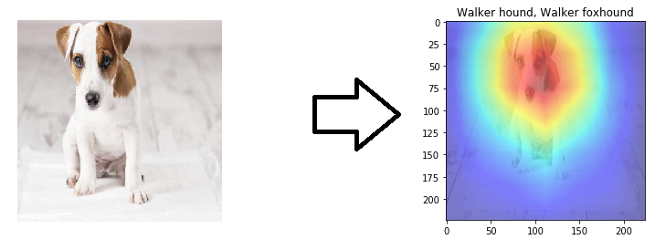

# CNN localization 

For me, Artificial Intelligence is like a passion and I am trying to use it to solve some daily life problems. In this tutorial/project, I want to give some intuitions to the readers about how convolutional neural networks are actually working.

One of the major issues when working with CNN is that how the network is actually learning is not directly exposed. You can only have some insights about how the network is thinking.

# Global Average Pooling

In the last few years, experts have turned to global average pooling (GAP) layers to minimize overfitting by reducing the total number of parameters in the model. Similar to max pooling layers, GAP layers are used to reduce the spatial dimensions of a three-dimensional tensor. However, GAP layers perform a more extreme type of dimensionality reduction, where a tensor with dimensions h×w×d is reduced in size to have dimensions 1×1×d. GAP layers reduce each h×w feature map to a single number by simply taking the average of all hw values.

In the recent years, reasearch discovers the role of global average pooling (GAP) layers in minimizing overfitting by reducing the total number of parameters in the model. In contrast to max pooling layers, GAP layers takes as input a tensor with dimensions [h,w,d] and reduce it to a vector of dimension [1,1,d]. For some given input hw feature map GAP layers reduces them to the average of all hw values.

# New archtecture

Networks, such as ResNet-50 model, took advantage of GAP layer to minimize overfitting by reducing the total number of parameters in the model (such as seen on the image). The GAP layer is took reduce the hw dimension and the densely connected layer (following the GAP layer) with a softmax activation function that yields the predicted object classes.

# Object Localization

In mid-2016, researchers at MIT demonstrated that CNNs with GAP layers (a.k.a. GAP-CNNs) that have been trained for a classification task can also be used for object localization. That is, a GAP-CNN not only tells us what object is contained in the image - it also tells us where the object is in the image, and through no additional work on our part! The localization is expressed as a heat map (referred to as a class activation map), where the color-coding scheme identifies regions that are relatively important for the GAP-CNN to perform the object identification task. This technique is described in [this paper](https://arxiv.org/pdf/1512.04150.pdf)

# Code

I wrote a simpe code in Keras to explain this process.

# Example

